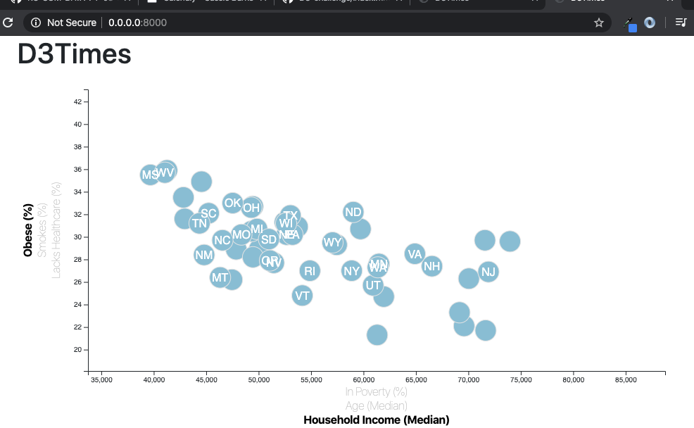

# D3 Data Journalism

## Summary

Use Javascript and D3 techniques created a dynamic scatter plot, to show different views of the data
by clicking the desired X Axis or Y Axis. Run a local server using "python -m http.server", to view the javascript interactions.

The scatter plot shows correlations between poverty, age, income and various factors that may increase health risks (lack of healthcare, smoking, and obesity). The data used was provided by the US Census Bureau through the 2014 American Community Survey.

## Web Page Output

